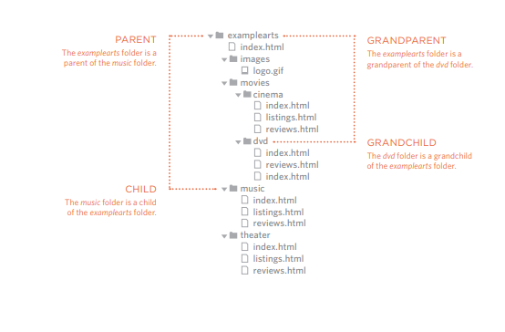

# More about html ,Css and JavaScript

## Links 
its an tag allow you to go to another webpage 
enabling idea of surfing

so we use tag **a** to line and use attribute href to set the link that we want to go for it

**you need to know** that you set between the open and close tag the text or image .. etc that you want to press to make you go throw the link.

ــــــــــــــــــــــــــــــــــــــــــــــــــــــــــــــــــــــــــــــــــــ

**You need to know** When someone do a big website that mean there are many pages we will have so now we will talk about Directory Structure to set in it multiple pages for the same site.

### What is Relative URls
that we use when linking to pages within your own
website.

There a types for Relative Link :
1. to be on same folor like : href="reviews.html"
2. Child foldor like :  href="music/listings.html"
3. Grandchild folor like :  href="movies/dvd/reviews.html
4. parent folor like :href="../index.html
5. Grandparent foldor like  : href="../../index.html">



ــــــــــــــــــــــــــــــــــــــــ

There a type of links called Email links and use "mailto:" inside the hred attribute  

there another attribute we use in tag a called target and we used if we want when clike open in new tab so we add this target="_blank" .

if you want to line something in same page like you want to going to conent in bootom from the nav bar so you can add for it an id and use it in href to go for it like  href="#TheID" 

and if its in another page you do like that href="theUrl/#TheID" 


to be continue ..

ــــــــــــــــــــــــــــــــــــــــــــــــــــــ


## Functions, Methods, and Objects ..! 
so what is the function ? its series of statement togather preform an task , to reuse this task again if you needed by called the function .

 decleare function its to give the function name and write the code , then when you need it you called it by using the name of it with brakets .

 example 
 to declare 
 ```
 function Hi()
 {
alert<'Hi'>
 }
 ```
 and to call 
 ```
 Hi();
 ```
 some time you need to use somthing parameters for the function , variables that recive an information to use it inside the function 
 ```
 function Hi(Massage)
 {
 alert(Massage)
 }
 ```
 so massage is called parameters that its ready to recice an info when you called it .

sometime you need to get an information or an value calculted in your fucntion so here u use return in end of your functio with the value you want to return.

last thing you need to know its that the parameters or any declered value inside called local variables , that mean you cant use outside the fuction ,because when the function end its will be destroyed automatacly .

ــــــــــــــــــــــــــــــــــــــــــــــــــــــــــــــــــــــــــ

## Building Blocks
we take earlier that css treat html tag like a box 

so we use that to make our structre more suitable for looking

so if we want to control the position of the element called  positioning schemes that  and his type are :
1. Normal flow
2. Relative Positioning
3. Absolute Positioning
4. Fixed Positioning 

and we used box offset properties to tell the browser how far from the top or bottom
and left or right it should be placed


ــــــــــــــــــــــــــــــــــــــــــــــــــــــــــــــــــــــــــ


## Now lets talk about Pair programming , What is that ! 
is the practice  of two developers sharing a single workstation to interactively tackle a coding task together  

like what people say:
>  “Two heads are better than one” 

so how that work?
its by using 2 roles 
1. **The driver**: who has his hand in keyboard and writing the code 
2. **Navigator** : who ues his word to guide the driver but dont do any input by keyboard , so its he who look in big picture and tell you what need to do next

**so why we do this pair programmer ?**

because the four fundamental skills
1. Listening
2. Speaking
3. Reading
4. Writing

so we do the four in this so that give you 
1.  Greater efficiency
2. Engaged collaboration
3.  Learning from fellow students
4. Social skills
5. Job interview readiness
6. Work environment readiness


