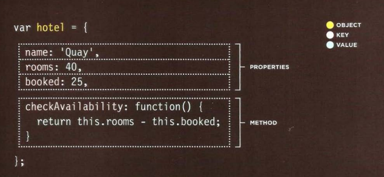
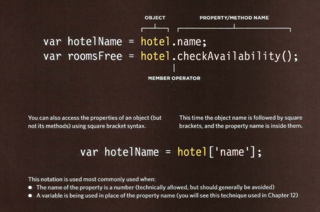
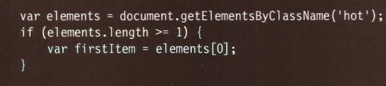
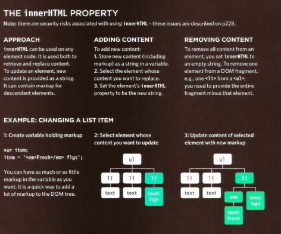
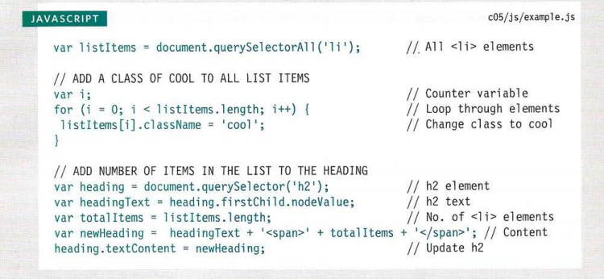

# The Problem Domain
Programming is easy if you understand the problem domain,So it is very difficult to solve a problem before you know the question

so we need to u do about it?
1. Make the problem domain easier
2. Get better at understanding the problem domain

and you can make  the problem domain easier by cutting out cases and narrowing your focus to a particular part of the problem. 

so after u set the Proplem domain u will be able to write the code very easily .

after that we can say Problem Domain is the area of expertise or application that needs to be examined to solve a problem.

---------------------------

# Objects 
 a set of variables and functions to **create a model**
of a something you would recognize from the **real world**.

To crate Object in javascript : 

and for accsess objects :

------------------------------------

#  Document Object Model (DOM)
The Document Object Model (DOM) specifies
how browsers should create a model of an HTML
page and how JavaScript can access and update the
contents of a web page while it is in the browser window. 

so The browser represents the page using a DOM tree. 

then u should know that DOM trees have four types of nodes: 
1. document nodes.
2. element nodes.
3. attribute nodes.
4. text nodes.

**Note** : The terms elements and element nodes are used interchangeably
but when people say the DOM is working with an element,
it is actually working with a node that represents that element. 

DOM queries may return one element, or they may return a Nodelist,
which is a collection of nodes. 

### METHODS THAT RETURN A SINGLE ELEMENT NODE: 
1. getElementByld('id')

2. querySel ector('css selector') 

### METHODS THAT RETURN ONE OR MORE ELEMENTS (AS A NODELIST): 
1. getEl ementsByClassName('class') 

2. getEl ementsByTagName('tagName')

3. querySelectorAll ('css selector')

SO TO SELECTING AN ELEMENT
FROM A NODELIST THERE ARE TO WAYS :
 1. THE Item{) METHOD  
 

 2. Array syntax .
  

  ---------------
  **traversing the DOM.**
  select
another element in relation to it using these five
properties
1. parentNode 
2. previousSibling
3. nextSibling  
4. firstChild
5. lastChild 

---------------
### InnerHtml
  

----

DOM manipulation offers another technique
to add new content to a page with 3 steps 
1. CREATE THE ELEMENT :createElement ()
2. GIVE IT CONTENt :createTextNode() 
3. ADD IT TO THE DOM :appendChild() 

## Examplae 

 
