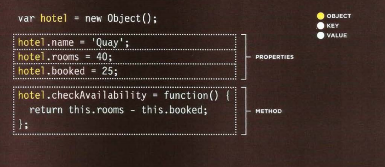

# Domain modeling
is the process of creating a conceptual model for a specific problem. And a domain model that's articulated well can verify and validate your understanding of that problem

**object-oriented model**
 Is an entity that stores data in properties and encapsulates behaviors in methods .
## Define a constructor and initialize properties
To define the same properties between many objects, you'll want to use a constructor function

 ### tips to follow when building your own domain models.
 1. When modeling a single entity that'll have many instances, build self-contained objects with the same attributes and behaviors
 2. Model its attributes with a constructor function that defines and initializes properties.
 3. Model its behaviors with small methods that focus on doing one job well.
 4. Create instances using the new keyword followed by a call to a constructor function.
 5. Store the newly created object in a variable so you can access its properties and methods from outside.
 6. Use the this variable within methods so you can access the object's properties and methods from inside.

 -----------------------
 # Tables
 What's a Table? 

table represents information in a grid format.

we use `<Table>` tag to create table in html
the contant will be write row by row 
so we need to start with row after table and we use `<tr>` to create row
then we insert the data in this row by using `<td>` stand for table data

More about Tabels 

1. `<th>` tag stands for table
heading to set headline to table 
2.  **colspan** attribute used for mix more than one column
3. **rowspan** ttribute used for mix more than one row.
4. `<thead>` :The headings of the table should
sit inside the <thead> element. 
5. `<tbody>` :The body should sit inside the <tbody> element. 
6. `<tfoot>` :The footer belongs inside 
7. **Width**: specify
the width of individual cells
8. **cellpadding**:  add space inside
each cell of the table
9. **cellspacing**: create
space between each cell
10.  **border**:  width of
the border in pixels
11. **bgcolor** : used
to indicate background colors 
----
## Objects 
the second way to creat obejects its to use new keyword with Object constrctor , its creat a blank Object

and u can update on value in same first way

### Constructor
Object constructors can use a function as a template for creating objects. 
its an fuction have name same of the object name 

**Note** : the arrays is special type of object and the string the same called Built-in Objects and there more 
