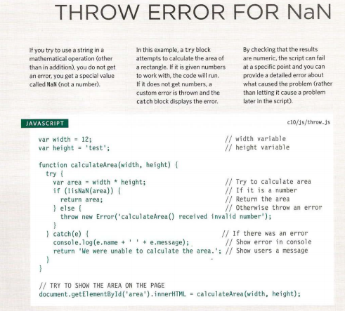

# Error Handling & Debugging

## Order Of Execution 

is realy help to know how script are processed , process by preocess ,some tasks cannot complete until another statement or function has been run:

##  Execution Contexts 
There is one global execution context; plus, each function creates a new
new execution context. They correspond to variable scope

## The Stack
Javascript proseess line by line at a time , So when data needed from another function its stacks the new function on top the currunt task;

## EXECUTION CONTEXT&HOISTING 
there are two phases
of activity:  
1. PREPARE
 - The new scope is created
 - Variables, functions, and arguments are created
 - The value of the this keyword is determined
2. EXECUTE
 - Now it can assign values to variables
 - Reference functions and run their code
 - Execute statements 

 Note : Understanding that these two phases happen helps
with understanding a concept called hoisting

### UNDERSTANDING SCOPE 
In the interpreter, each execution context has its own va ri ables object.
It holds the variables, functions, and parameters available within it.
Each execution context can also access its parent's v a ri ables object. 

### UNDERSTANDING ERRORS 
If a JavaScript statement generates an error, then it throws an exception.
At that point, the interpreter stops and looks for **exception-handling** code. 

### ERROR OBJECTS
Error objects can help you find where your mistakes are
and browsers have tools to help you read them. 

## ERROR OBJECTS CONTINUED 
1. Syntax Error : SYNTAX IS NOT CORRECT .
2. Ref erenceError  : VARIABLE DOES NOT EXIST  ,VARIABLE IS UNDECLARED ,etc.
3. Eval Error:  INCORRECT USE OF eval() FUNCTION .
4. URI Error :INCORRECT USE OF URI FUNCTIONS.
5. Type Error :VALUE IS UNEXPECTED DATA TYPE .
6. Range Error: NUMBER OUTSIDE OF RANGE .
7. Error :GENERIC ERROR OBJECT .
8. NaN :Not a Number.

Note : GENERIC ERROR OBJECT :The generic Error object is the template (or
prototype) from which all other error objects are
created.

## A DEBUGGING WORKFLOW 
Debugging is about deduction: eliminating potential causes of an error. 

### BREAKPOINTS 
You can pause the execution of a script on any
line using breakpoints. Then you can check the
values stored in variables at that point in time.  

Note : there CONDITIONAL BREAKPOINT that work in CONDITIONAL

## DEBUGGER KEYWORD  
You can create a breakpoint
in your code using just the
debugger keyword. When the
developer tools are open, this
will automatically create a
breakpoint. 

## HANDLING EXCEPTIONS
If you know your code might fail, use try, catch, and finally.
Each one is given its own code block. 

we use here 
1. try :you specify the code
that you think might throw an
exception within the try block. 

2. CATCH: If the try code block throws an
exception, catch steps in with an
alternative set of code. 

3. FINALLY :The contents of the finally
code block will run either
way - whether the try block
succeeded or failed

## THROWING ERRORS
If you know something might cause a problem for your script, you can
generate your own errors before the interpreter creates them. 

using `throw new Error( 1
message 1
) ; `

Example :

